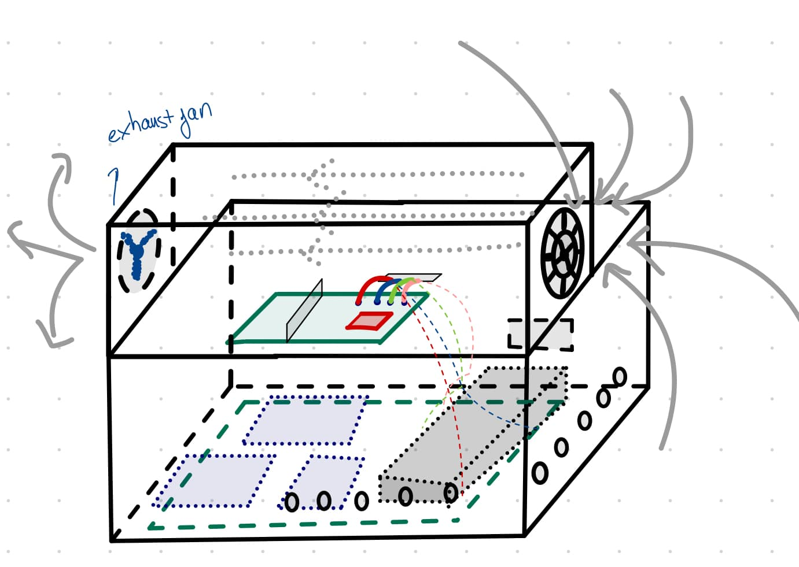
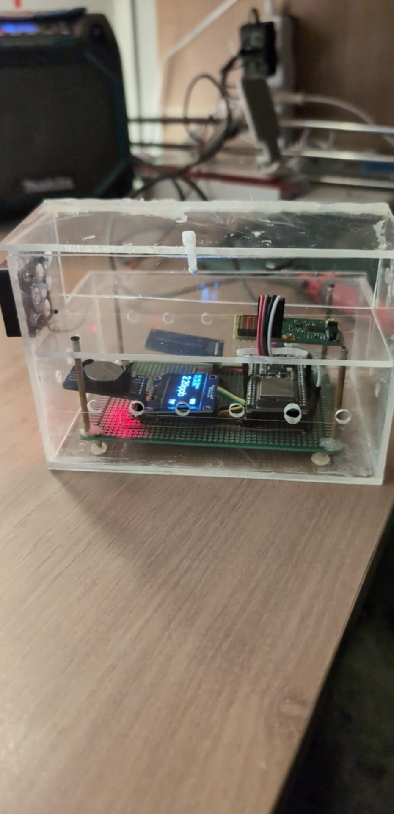
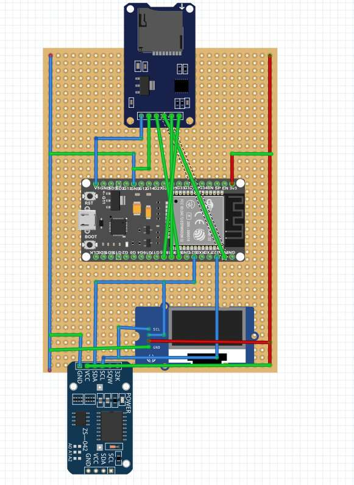
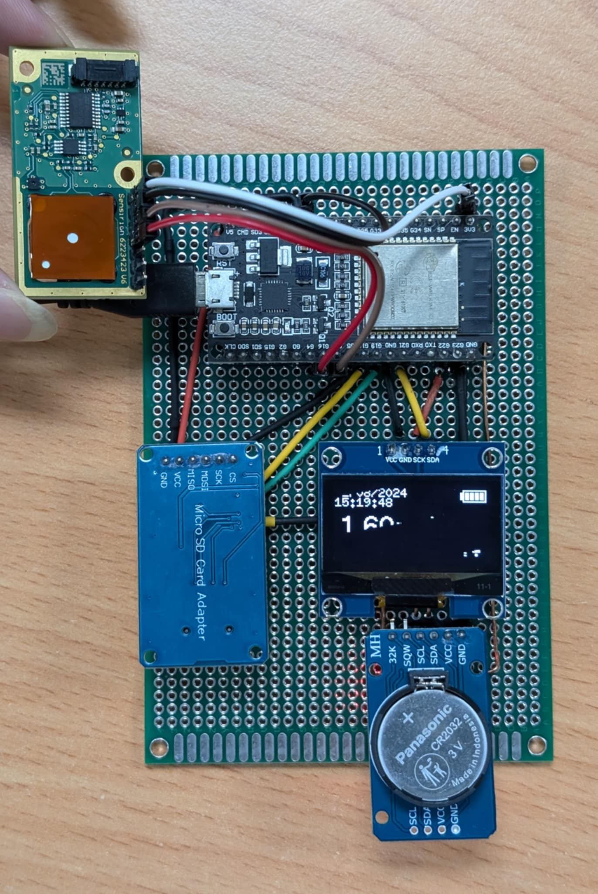
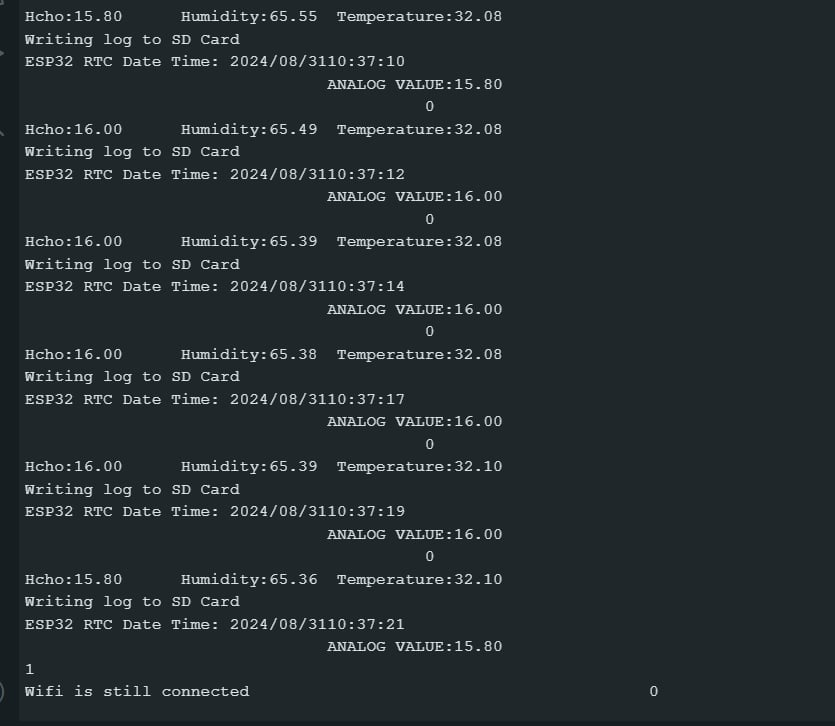
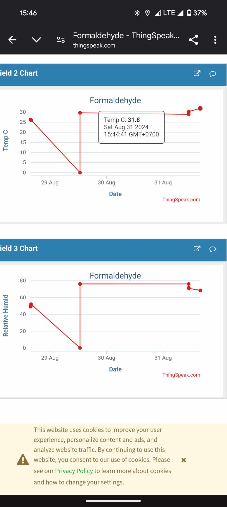

# Real-Time HCHO Measurement System (Role: Hardware Designer & Co-Contributor)

This repository contains an independent extracurricular project developed by a two-student team during our Electrical and Computer Engineering (ECE) studies at the Vietnamese-German University (VGU).

I worked as the **Hardware Designer and Co-Contributor** alongside **Lê Huỳnh Văn Hóa**, under the supervision of **Hồ Hữu Khánh An** and the academic guidance of **Professor Võ Bích Hiển**.

## 🖥️ About the Project

This project is a portable embedded system designed to measure and monitor indoor **formaldehyde (HCHO)** concentration.

The final prototype uses a **Sensirion SFA30 formaldehyde sensor** and an **ESP32-WROOM-32U** as its central processing unit. The system can display the measured HCHO concentration locally, timestamp the measurements, save the collected data to a microSD card, and support remote monitoring through ThingSpeak.

The electronic components were soldered onto a prototyping board and installed inside a custom transparent enclosure. Ventilation holes and intake/exhaust fans were included to maintain airflow through the sensing chamber while protecting the internal electronics.

## 👤 My Hardware Contribution

As the hardware member of the two-student team, I was responsible for:

* Designing and drawing the complete system schematic.
* Planning the hardware architecture and component connections.
* Integrating the ESP32, SFA30 sensor, OLED display, RTC, and microSD module.
* Selecting and assigning the ESP32 GPIO connections.
* Wiring and soldering the components onto the prototyping board.
* Testing the electrical connections and troubleshooting hardware problems.
* Replacing the original SPI TFT display with a compact I2C OLED to reduce cable clutter.
* Designing the transparent protective enclosure.
* Planning the ventilation holes and intake/exhaust airflow.
* Installing and organizing the electronics inside the final enclosure.
* Preparing hardware diagrams, photographs, and technical documentation.

The firmware, Wi-Fi communication, and ThingSpeak cloud integration were handled by the other student contributor.

## 🛠️ Hardware Components

* **ESP32-WROOM-32U:** Central microcontroller and system controller.
* **Sensirion SFA30:** I2C sensor used to measure formaldehyde concentration.
* **SH1106 OLED:** Displays the HCHO value, date, time, and system-status icons.
* **DS3231 RTC:** Provides accurate timestamps for the recorded measurements.
* **MicroSD Card Module:** Stores timestamped HCHO measurements locally.
* **Prototyping Board:** Provides permanent mounting and soldered electrical connections.
* **5 V Power Bank:** Supplies portable power during testing.
* **Transparent Enclosure:** Protects the electronics while allowing visual inspection.
* **Ventilation Fans and Openings:** Maintain airflow through the measurement enclosure.

## 🔌 Final Hardware Connections

| Component | ESP32 Connection |
|---|---|
| SFA30 VCC | 3.3 V |
| SFA30 GND | GND |
| SFA30 SDA | GPIO21 |
| SFA30 SCL | GPIO22 |
| SFA30 SEL | GND |
| DS3231 VCC | 3.3 V |
| DS3231 GND | GND |
| DS3231 SDA | GPIO21 |
| DS3231 SCL | GPIO22 |
| SH1106 OLED VCC | 3.3 V |
| SH1106 OLED GND | GND |
| SH1106 OLED SDA | GPIO21 |
| SH1106 OLED SCL | GPIO22 |
| MicroSD VCC | 5 V |
| MicroSD GND | GND |
| MicroSD MISO | GPIO19 |
| MicroSD MOSI | GPIO23 |
| MicroSD SCK | GPIO18 |
| MicroSD CS | GPIO5 |

The SFA30 sensor, DS3231 RTC, and SH1106 OLED share the same I2C communication bus through GPIO21 and GPIO22. The microSD card uses a separate SPI connection.

## 🔄 Hardware Development Process

### Stage 1 — Breadboard Proof of Concept

The first hardware prototype used:

* An ESP32 development board.
* A temporary low-cost gas sensor.
* A DS3231 real-time clock.
* An SPI TFT display.
* Breadboard connections and jumper wires.

This stage was used to verify the basic component connections and confirm that the ESP32 could receive sensor data and display the measured value.

* [Watch First-Stage Hardware Demonstration](HCHO%20demo%281%29%20First%20stage.mp4)
* [Watch First-Stage System Demonstration](HCHO%20demo%282%29%20First%20stage.mp4)

### Stage 2 — Hardware Improvement

The initial prototype had excessive jumper wiring and several unreliable components. To improve the system:

* The temporary gas sensor was replaced with the Sensirion SFA30.
* The SPI TFT display was replaced with an I2C SH1106 OLED.
* The faulty microSD card was replaced.
* The wiring architecture was simplified.
* The final circuit schematic was redesigned.
* The components were transferred from a breadboard to a soldered prototyping board.

### Stage 3 — Final Enclosure

A transparent protective enclosure was designed to:

* Protect the electronic components.
* Keep the system portable.
* Allow the internal hardware to remain visible.
* Support controlled airflow around the HCHO sensor.
* Provide mounting positions for the circuit board and ventilation fans.
* Make future hardware maintenance easier.

## 📷 Hardware Design & Prototype

### Enclosure and Airflow Concept

The enclosure concept shows the proposed arrangement of the electronics, ventilation openings, intake fan, and exhaust fan.

### Final Enclosed Prototype

The completed hardware was installed inside the transparent ventilated enclosure.

### Final Hardware Schematic

The schematic illustrates the electrical connections between the ESP32, HCHO sensor, OLED display, RTC, and microSD card module.

### Soldered Hardware Assembly

The final components were soldered onto a prototyping board to improve connection stability and reduce the number of loose jumper wires.

## 📊 Complete Team-System Verification

The completed team system successfully demonstrated:

* HCHO sensor data acquisition.
* Local display of the measured concentration.
* RTC-based date and time information.
* Timestamped microSD-card logging.
* Serial-terminal monitoring.
* Remote ThingSpeak visualization.

My responsibility during system verification was ensuring that the sensor, display, RTC, storage module, power connections, and supporting hardware operated correctly. The firmware and ThingSpeak functions were implemented by my teammate.

### Serial Output and Hardware Logging Test

### ThingSpeak Dashboard Result

## 📄 Project Documentation

* [Final Project Report — July 2024](HCHO%20MEASURE%20FINAL%20REPORT.pdf)
* [Initial Project Report](HCHO%20MEASURE%20PROJECT%20REPORT.pdf)
* [Project Progress Update — 18 June 2024](HCHO%2018-06-2024.pdf)

## ⚠️ Prototype Status & Limitations

This system is an engineering prototype that reached the preliminary laboratory-testing stage. It is **not a calibrated or certified air-quality safety instrument**.

The remaining hardware limitations include:

* Possible variation in the sensor output.
* Prototype-grade electrical connections.
* Limited power-distribution design.
* Dependence on a portable power bank.
* The need for comparison with a calibrated reference instrument.
* The need for additional controlled laboratory testing.

Further calibration, PCB development, power-system improvement, and controlled testing would be required before practical safety deployment.
